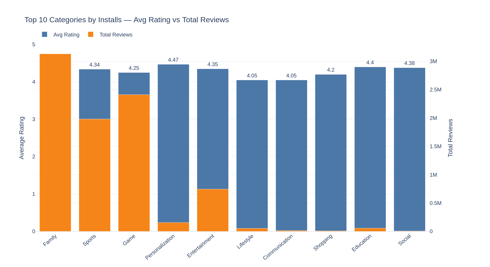
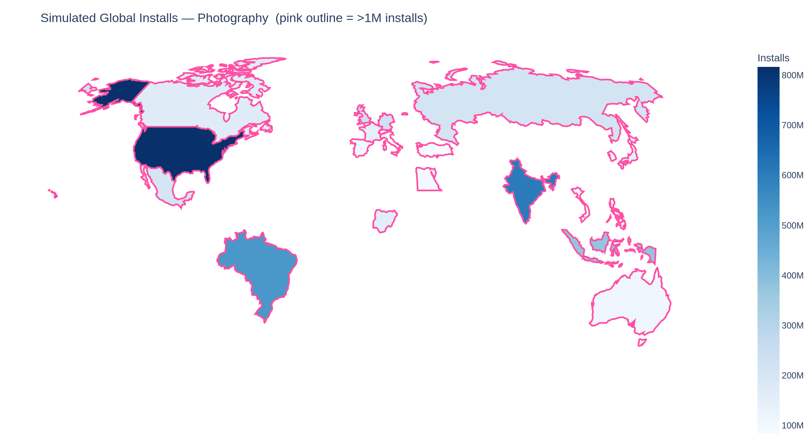
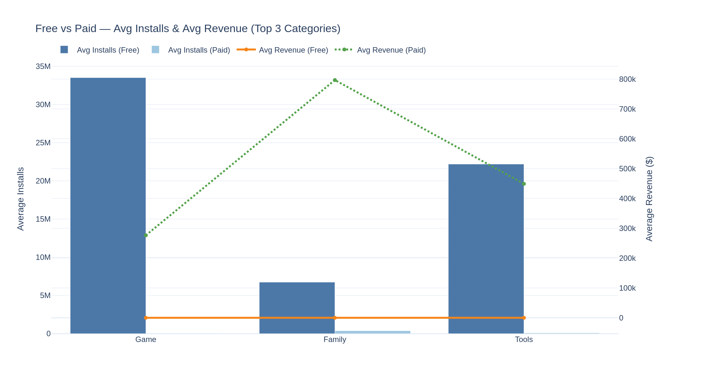
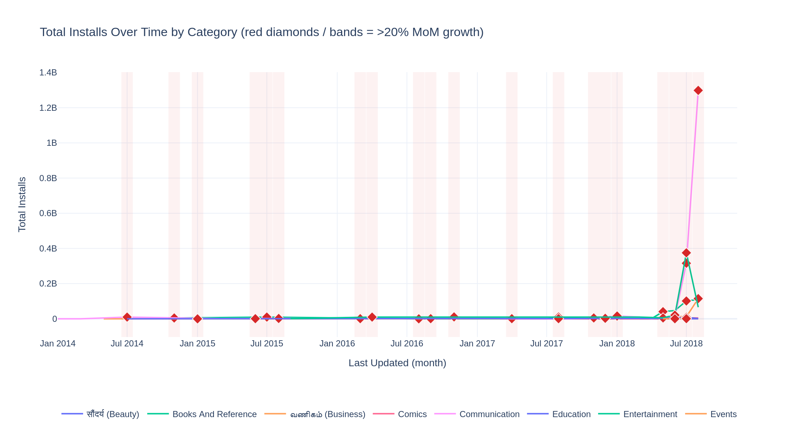
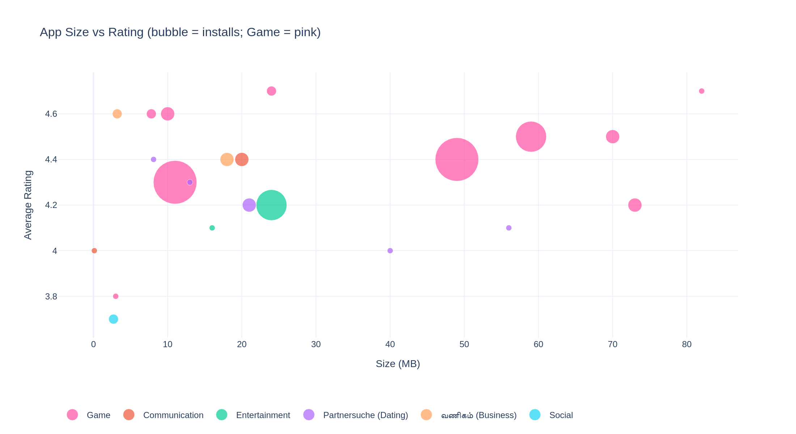
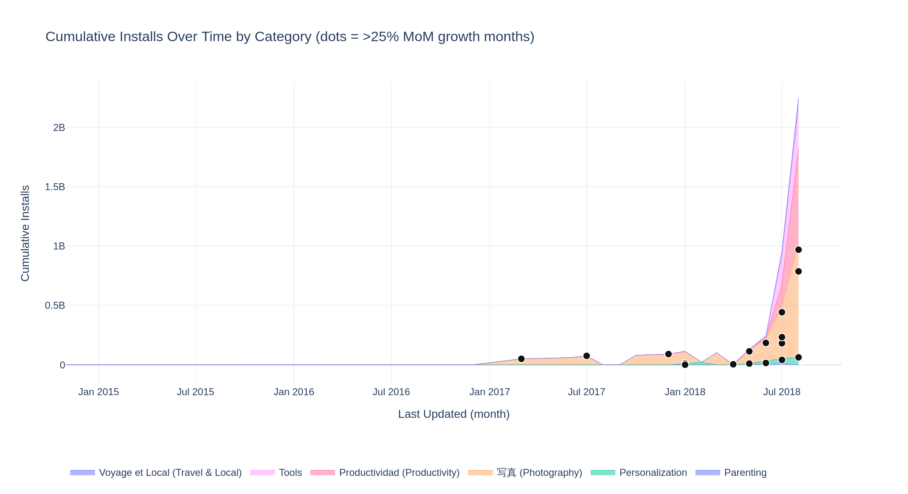

# Google Play Store — Internship Analytics Dashboard

An interactive **Streamlit + Plotly** dashboard built on the Google Play Store
dataset from the training project. It implements all six internship tasks as
filtered, time-gated, interactive visualisations on the **same dataset** used
during training (Kaggle *Google Play Store Apps* — `googleplaystore.csv` +
`googleplaystore_user_reviews.csv`).

> Each chart is only displayed inside its assigned **IST time window** per the
> brief. A **Preview mode** toggle in the sidebar lets a reviewer inspect every
> chart regardless of the current time.

---

## 🚀 Live demo / hosting

Deploy free on **Streamlit Community Cloud**:

1. Push this repo to GitHub.
2. Go to [share.streamlit.io](https://share.streamlit.io) → **New app**.
3. Point it at your repo, branch `main`, main file **`app.py`**.
4. Deploy — you get a public `https://<app>.streamlit.app` link to submit.

Run locally instead:

```bash
pip install -r requirements.txt
streamlit run app.py
```

---

## 📁 Project structure

```
playstore-dashboard/
├── app.py                     # Streamlit dashboard (navigation, KPIs, time-gates)
├── requirements.txt
├── generate_screenshots.py    # renders each chart to assets/*.png
├── src/
│   ├── data_prep.py           # loading, cleaning, translations, sentiment, geo
│   ├── tasks.py               # one chart-builder per task (1–6)
│   └── timegate.py            # IST display-window logic
├── data/
│   ├── googleplaystore.csv
│   ├── googleplaystore_user_reviews.csv
│   └── countries.geo.json     # world boundaries for the choropleth
└── assets/                    # chart screenshots (below)
```

---

## 🗂 Dataset

| File | Rows | Key columns used |
|------|------|------------------|
| `googleplaystore.csv` | ~10.8k | App, Category, Rating, Reviews, Size, Installs, Type, Price, Content Rating, Android Ver, Last Updated |
| `googleplaystore_user_reviews.csv` | ~64k | App, Sentiment_Polarity, **Sentiment_Subjectivity** |

After cleaning and de-duplication: **8,196 unique apps across 33 categories**,
`Last Updated` spanning **May 2010 → Aug 2018**.

---

## 🧹 Transformations applied

All cleaning lives in `src/data_prep.py`:

- **Size** → megabytes (`"19M"→19`, `"512k"→0.5`, `"Varies with device"→NaN`).
- **Installs / Reviews** → integers (`"10,000+"→10000`).
- **Price** → float (`"$4.99"→4.99`).
- **Android Ver** → numeric (`"4.0.3 and up"→4.0`).
- **Last Updated** → datetime, plus `Update_Month` and monthly `Update_Period`.
- The single well-known **corrupt row** (shifted columns → rating 19) is dropped.
- Apps **de-duplicated** by name, keeping the most-reviewed record.
- **Sentiment subjectivity** merged as the mean per app from the reviews file.

**Derived / simulated fields** (the source lacks these, documented in-app):

- **Revenue** = `Price × Installs` (no revenue column exists).
- **Geography** for the choropleth is **simulated** deterministically (fixed
  seed) across a basket of 20 markets — the dataset has no country field.
- **"Over time"** in the time-series/area charts uses `Last Updated` as the
  only available date dimension.

---

## 📊 KPIs measured

Total apps · total installs (≈ tens of billions) · average rating · paid-app
count (header strip), plus per-task metrics: category average rating, total
reviews, total & average installs, average revenue, month-over-month install
growth %, cumulative installs, and mean sentiment subjectivity.

---

## ✅ The six tasks

| # | Chart | Core filters | Window (IST) |
|---|-------|--------------|--------------|
| 1 | Grouped bar — avg rating vs total reviews, top 10 categories by installs | Size ≥ 10 MB · Jan updates · cat. avg rating ≥ 4.0 | 3–5 PM |
| 2 | Choropleth — installs by category (simulated geo) | Top 5 categories not starting A/C/G/S · pink outline > 1M installs | 6–8 PM |
| 3 | Dual-axis — avg installs & revenue, Free vs Paid, top 3 categories | Name ≤ 30 chars · Everyone · Installs ≥ 10k · Android > 4.0 · Size > 15 MB · Revenue ≥ $10k (paid) | 1–2 PM |
| 4 | Time series — installs over time by category, >20% MoM shaded | Cat. E/C/B · name not x/y/z & no "s" · Reviews > 500 · Beauty→Hindi, Business→Tamil, Dating→German | 6–9 PM |
| 5 | Bubble — size vs rating, bubble = installs | Rating > 3.5 · selected cats · Reviews > 500 · no "s" · Subjectivity > 0.5 · Installs > 50k · Game = pink · same translations | 5–7 PM |
| 6 | Stacked area — cumulative installs by category, >25% MoM intensified | Rating ≥ 4.2 · no digits in name · cat. T/P · Reviews > 1000 · Size 20–80 MB · Travel & Local→French, Productivity→Spanish, Photography→Japanese | 4–6 PM |

### Category translations
Beauty → **सौंदर्य** (Hindi) · Business → **வணிகம்** (Tamil) · Dating →
**Partnersuche** (German) · Travel & Local → **Voyage et Local** (French) ·
Productivity → **Productividad** (Spanish) · Photography → **写真** (Japanese).

### A note on two intentionally-contradictory filters
- **Task 3** asks to compare Free vs Paid but also to exclude revenue < $10k.
  Free apps have $0 revenue by definition, so applying that filter to them would
  leave no "free" bar. The revenue filter is therefore applied to **paid apps
  only**, preserving the free-vs-paid comparison the task asks for.
- **Task 2** highlights markets exceeding 1M installs. With the simulated
  distribution most markets clear that bar, so the highlight is drawn as a bold
  **outline** over the real fill rather than repainting the map.

---

## 🖼 Screenshots

### Task 1 — Top 10 categories: rating vs reviews


### Task 2 — Global installs choropleth (simulated)


### Task 3 — Free vs Paid: installs & revenue


### Task 4 — Installs over time by category


### Task 5 — Size vs rating bubble chart


### Task 6 — Cumulative installs (stacked area)


---

## 🔧 Regenerate screenshots

```bash
pip install "kaleido==0.2.1"
python generate_screenshots.py
```

---

*Built for the Elevance Skills data-analytics internship, extending the training
project on the Google Play Store dataset.*
